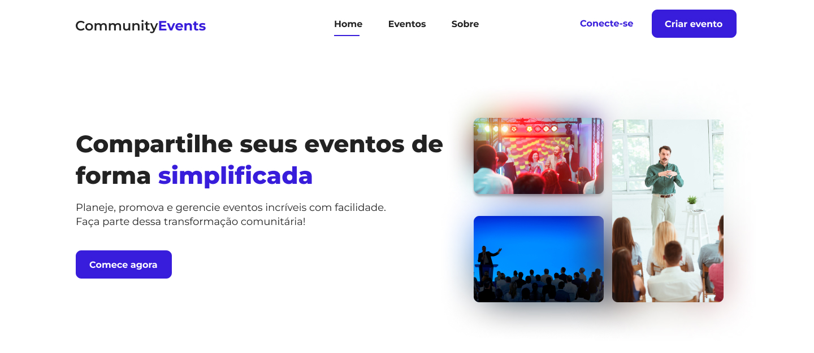

<h1 align="center"> Community Events </h1>

  

Web site desenvolvido durante a disciplina de Estágio na faculdade de Sistemas de Informação.

## Funcionalidades
 - Criar conta
 - Sair da conta
 - Criar evento
 - Atualizar evento
 - Excluir evento
 - Página exclusiva do evento

## 🚀 Tecnologias

Esse projeto foi desenvolvido com as seguintes tecnologias:

- React
- TypeScript
- Styled-Components
- Material UI
- Zod
- Swiper
- Firebase
- Git e Github

## 💻 Projeto

A proposta era criar uma plataforma de divulgação de eventos básica para praticar os conhecimentos de Front-End adquiridos no período de estágio.

## 🔖 Layout

Você pode visualizar o layout do projeto através [DESSE LINK](https://www.figma.com/design/UYqTXOmEcdKlB6Upnrbepw/Untitled?node-id=188-142&p=f&t=Nj5fDC4yibab2PWk-0). É necessário ter conta no [Figma](https://figma.com) para acessá-lo.

## :memo: Licença

Esse projeto está sob a licença MIT.